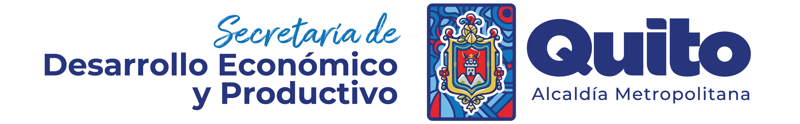

<h1 align="center">Servicios Profesionales para la Secretaría de Desarrollo Económico y Productivo del MDMQ</h1>
<h2 align="center">Data Warehouse Analítico con <strong>R</strong></h2>
<p align="center"></p> 

Código de tipo **ETL** _*(Extract, Transform, Load)*_ desarrollados en **R** para la construcción del Data Warehouse Analítico de la Secretaría de Desarrollo Económico y Productivo del Municipio del Distrito Metropolitano de Quito.

- **Developer:** Mgs. Marcelo Chávez
- **Fecha de creación de repositorio de versionamiento:** 25 de junio de 2024
- **Copyright 2024:** Derechos Reservados por el autor
- **Disclaimer:** Se prohíbe la reproducción total, parcial o plagio de cualquier elemento o bloque de código publicado en este repositorio digital

## Documentación de Soporte y Uso de herramientas digitales - README.md

Esta es una plantilla basada en los estándares de la Guía de publicación de herramientas digitales del BID. Sabemos que no existe un solo estándar para la documentación de soporte y uso de herramientas digitales, pero hemos recopilado estas características más importantes que debe tener un README.md

*Esta herramienta digital forma parte del portafolio de servicios profesionales del Consultor. Puedes contactarte vía e-mail a: [marcelo_chavez_ec@outlook.com]*

## Tabla de contenidos:

- [Badges o escudos](#badges-o-escudos)
- [Descripción y contexto](#descripción-y-contexto)
- [Guía de usuario](#guía-de-usuario)
- [Guía de instalación](#guía-de-instalación)
- [Dependencias](#dependencias)
- [Código de conducta](#código-de-conducta)
- [Autor](#autores)
- [Información adicional](#información-adicional)
- [Licencia](#licencia)
- [Limitación de responsabilidades - Solo BID](#limitación-de-responsabilidades)

### Ecosistema de **R**

- 
- 
- 
- 
- 

## Descripción y contexto

El proyecto **Data Warehouse Analítico para la Secretaría de Desarrollo Económico y Productivo** tiene como objetivo la construcción de un Data Warehouse Analítico para la Secretaría de Desarrollo Económico y Productivo del Municipio del Distrito Metropolitano de Quito. Utilizando procesos de ETL desarrollados en **R** y haciendo uso de los paquetes **Tidyverse**, **RPostgreSQL**, y **Shiny**, se extrae, transforma y carga la información necesaria para el análisis y toma de decisiones estratégicas.

## Guía de usuario

Para usar esta herramienta digital, sigue los siguientes pasos:

**Clonar el repositorio:**
   ```sh
   git clone https://github.com/tu-usuario/MDMQ_DWA.git
   ```
